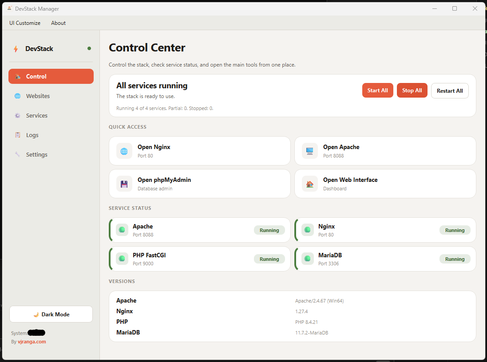

# DevStack Manager (Portable)

DevStack Manager is a portable local web stack for Windows with:

- Apache
- Nginx
- MariaDB
- Multiple PHP versions

You can move the full folder to another drive/path and run it without reinstalling.

## Screenshot



## Current UI

- `Control`: quick status + open links
- `Websites`: create websites, pick PHP version, list detected projects
- `Services`: start/stop/restart Apache, Nginx, PHP, MariaDB
- `Logs`: view service logs
- `Settings`: ports, refresh interval, PHP version management
- Top menu actions: `UI Customize`, `About`

## Websites Tab Features

- Create website folder directly in `htdocs`
- No database creation during website creation
- Auto-detect website type:
  - Plain PHP
  - WordPress
  - Drupal
  - Laravel
- Per-site PHP version override via `.htaccess` FastCGI mapping

## Portable Run

1. Open `devstack-app/Run DevStack Manager.bat`
2. Start services from `Services` tab
3. Create/manage sites from `Websites` tab

## Notes

- Apache now attempts graceful shutdown before force kill to reduce unclean PID warnings.
- MariaDB local grants are auto-applied at startup via `devstack-template/mysql/devstack-grants.sql`.

## Repo Structure (Simplified)

```
devstack-app/
  core/
  ui/
  main.py

devstack-template/
  apache/
  nginx/
  mysql/
  php/
  php74/
  php83/
  htdocs/
```
