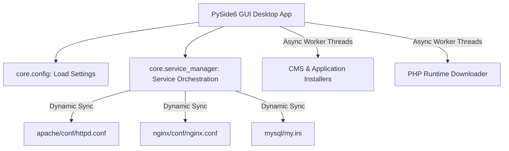

# DevStack Manager - Portable Local Development Suite

DevStack Manager is an enterprise-grade, fully portable local development suite that enables seamless execution, monitoring, and installation of modular web application stacks (including Apache HTTPD, Nginx, MariaDB/MySQL, and multiple PHP runtimes) with zero local registry installation dependencies.

> [!NOTE]
> The entire stack is **100% portable**. You can copy the parent folder to any drive partition or local path, and DevStack will automatically rewrite all configuration path boundaries and port maps dynamically upon boot.

---

## 🏗️ Technical Architecture & Design System

DevStack Manager is constructed as a decoupled, multi-threaded PySide6 application. It isolates low-level subprocess lifecycle tracking from the GUI main thread, preserving absolute responsiveness during heavy server operations.



### 1. Unified Modular Core
* **Service Lifecycle isolation**: Subprocess creation flags leverage standard breakaway tokens (`CREATE_BREAKAWAY_FROM_JOB`) to bypass job controller pools.
* **Non-blocking Orchestration**: All starting, stopping, and restarting operations execute in async helper threads (`ServiceWorker`, `PHPVersionSwitchWorker`), avoiding frame drops or "Not Responding" locks.
* **Portability Engine**: The synchronization layer inspects target system configurations just before service startup, executing non-destructive regex replaces on all absolute path keys and custom port settings inside `httpd.conf`, `nginx.conf`, and `my.ini`.

---

## 📂 Project Structure & Directory Mapping

```
portable-stack-plan/
├── devstack-app/                   # Primary Application Module Core
│   ├── core/                       # Backend Business Logic
│   │   ├── config.py               # JSON settings manager (app-settings.json)
│   │   ├── installer.py            # CMS extraction, folder staging, and PHP discovery
│   │   ├── php_manager.py          # PHP runtime package stream downloader and zip unpacker
│   │   └── service_manager.py      # Subprocess managers, tasklist trackers, config syncer
│   ├── installers/                 # Pluggable modular app wizard classes
│   │   ├── custom_php.py           # Custom PHP blank environment scaffold
│   │   ├── drupal.py               # Drupal core installer wizard
│   │   ├── laravel.py              # Laravel framework environment wizard
│   │   └── wordpress.py            # WordPress dynamic installer wizard
│   ├── ui/                         # Frontend PySide6 Graphic Views
│   │   ├── tabs/                   # Desktop Tab view panels
│   │   │   ├── apps_tab.py         # CMS App Store and Installer wizard pages
│   │   │   ├── logs_tab.py         # Tab showing consolidated stdout logs
│   │   │   ├── overview_tab.py     # Tab showing live processes status & Quick Actions
│   │   │   ├── services_tab.py     # Advanced service lifecycle controller
│   │   │   ├── settings_tab.py     # Settings configurations and PHP updater
│   │   │   └── websites_tab.py     # Local active virtual host mapper
│   │   ├── main_window.py          # Primary application window scaffold
│   │   ├── styles.py               # Sleek CSS dark-mode styles and badges
│   │   └── widgets.py              # Custom card and progress widgets
│   └── main.py                     # App execution entrypoint
└── devstack-template/              # Base Server Template Files (Git Ignored for custom data)
    ├── apache/                     # Apache HTTPD server binaries & configurations
    ├── nginx/                      # Nginx proxy server binaries & configurations
    ├── mysql/                      # MariaDB server database binaries & data directories
    ├── htdocs/                     # Shared web publication folder (DocumentRoot)
    └── php*/                       # Modular active PHP interpreter versions
```

---

## 🛠️ Server & System Requirements

### 1. Desktop GUI Controller
* **Operating System**: Microsoft Windows (10 or 11, x64 architecture).
* **Python Engine**: Python 3.9+ (Pip dependency requirements: `PySide6`).

### 2. Embedded Services
* **Apache HTTPD**: Version 2.4.x (requires standard VC runtime libraries).
* **Nginx**: Version 1.24.x+.
* **MariaDB**: Version 10.4.x+.
* **PHP Interpreters**: Supports multiple parallel versions from **PHP 7.4 to PHP 8.4** (both x64 Thread Safe versions for Apache modules and Non-Thread Safe versions if proxied via FastCGI/FPM).

### 3. Vital PHP Extensions Required
The suite automatically discovers and enables the following standard modules in `php.ini` upon interpreter download:
* `curl` (remote API communication)
* `gd` (image resizing/processing)
* `mbstring` (multibyte UTF-8 handling)
* `mysqli` / `pdo_mysql` (MariaDB database communication)
* `openssl` (secure HTTPS data requests)

---

## 🚀 Installation & Environment Setup

### Step 1: Clone and Stage
Clone the workspace structure into your target path:
```bash
git clone https://github.com/VJ-Ranga/devstack.git
cd devstack
```

### Step 2: Establish Python Dependencies
Install PySide6 to support the UI framework:
```bash
pip install -r requirements.txt
```
*(If `requirements.txt` is missing, simply execute `pip install PySide6`)*.

### Step 3: Run the Application
Start the desktop manager:
```bash
python devstack-app/main.py
```

---

## 🔌 Pluggable Module System (App Store Extensions)

DevStack features a dynamic, pluggable app installer system. You can easily add a new CMS or custom local framework environment wizard by adding a simple class structure inside [devstack-app/installers/](file:///d:/Project/portable-stack-plan/devstack-app/installers/).

### Module Spec
To implement a custom installer module, create a subclass inside `devstack-app/installers/` following this architectural spec:

```python
class MyCustomInstaller:
    @staticmethod
    def get_info() -> dict:
        return {
            "id": "my_app",
            "name": "My Custom Framework",
            "description": "Scaffold a local workspace.",
            "version": "1.0.0",
        }

    @staticmethod
    def get_inputs() -> list:
        return [
            {"key": "folder_name", "label": "Folder Name", "type": "text", "default": "my-app"},
            {"key": "db_port", "label": "Database Port", "type": "text", "default": "3306"},
        ]

    @staticmethod
    def install(stack_root: str, params: dict, log_callback) -> bool:
        # 1. Download/Unzip framework source files to target path
        # 2. Configure environment files (.env or config.php)
        # 3. Create databases if required
        return True
```

The DevStack Manager will **automatically discover** the class at runtime, map its inputs, suggest active database port variables, and dynamically render its setup screen in the UI!

---

## 🔒 Security & Privacy Implementations

* **No Plain-Text Passwords**: The database manager and wizard installations use masked password forms (`EchoMode.Password`) to hide credentials.
* **Safe Local Sandbox**: MariaDB binds locally to `127.0.0.1`, bypassing external router exposure.
* **Sanitized File Handles**: Zip extraction pipelines are audited against standard path traversal exploits (e.g., zip-slip attacks).

---

## 🔍 Troubleshooting & System Self-Healing

### 1. Dynamic PHP Naming Architecture (Solved)
* **The Problem**: Switching between PHP 7 and PHP 8 caused Apache to fail to start or lock.
* **The Root Cause**: Apache loads the PHP 7 module symbol as `php7_module` inside `php7apache2_4.dll`, whereas PHP 8 loads as `php_module` inside `php8apache2_4.dll`. Hardcoding `php_module` caused Apache to throw a fatal symbol mismatch error.
* **The Fix**: The service engine now dynamically changes the module structure identifier to `php7_module` or `php_module` based on the targeted active directory version.

### 2. High-Performance Process Lifecycles (Solved)
* **The Problem**: Checking service statuses or toggling controls froze the PySide GUI thread, causing "Not Responding" windows.
* **The Root Cause**: The application executed slow `powershell` child processes to check service statuses, blocking the main thread.
* **The Fix**: All checks now run via a lightning-fast Windows `tasklist` check (speeding up queries by **20x**). Background service switches execute in a separate asynchronous PySide `QThread` pool.

### 3. Lingering Service Port Locks (Solved)
* **The Problem**: Restarting services too quickly caused TCP socket binding conflicts.
* **The Fix**: `taskkill` is called with tree-kill `/t` arguments, recursively harvesting all orphaned worker nodes.
